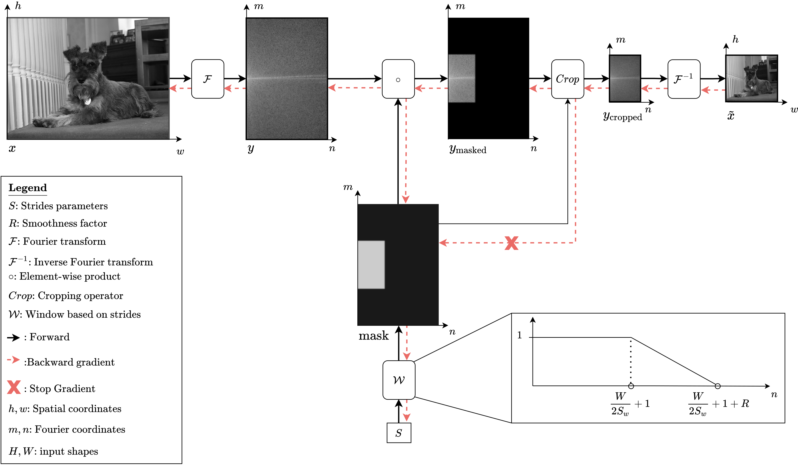

# DiffStride: Learning strides in convolutional neural networks



DiffStride is a pooling layer with learnable strides. Unlike strided convolutions, average pooling or max-pooling that require cross-validating stride values at each layer, DiffStride can be initialized with an arbitrary value at each layer (e.g. `(2, 2`) and during training its strides will be optimized for the task at hand.

We describe DiffStride in our ICLR 2022 paper [Learning Strides in Convolutional Neural Network](https://arxiv.org/abs/2202.01653). Compared to the experiments described in the paper, this implementation uses a [Pre-Act Resnet](https://arxiv.org/abs/1603.05027) and uses [Mixup](https://arxiv.org/abs/1710.09412) in training.

## Installation

To install the diffstride library, run the following `pip` git clone this repo:

```
git clone https://github.com/google-research/diffstride.git
```

The cd into the root and run the command:
```
pip install -e .
```

## Example training

To run an example training on CIFAR10 and save the result in TensorBoard:

```
python3 -m diffstride.examples.main \
  --gin_config=cifar10.gin \
  --gin_bindings="train.workdir = '/tmp/exp/diffstride/resnet18/'"
```

## Using custom parameters
This implementation uses [Gin](https://github.com/google/gin-config) to parametrize the model, data processing and training loop.
To use custom parameters, one should edit `examples/cifar10.gin`.

For example, to train with SpectralPooling on cifar100:

```
data.load_datasets:
  name = 'cifar100'

resnet.Resnet:
  pooling_cls = @pooling.FixedSpectralPooling
```

Or to train with strided convolutions and without Mixup:

```
data.load_datasets:
  mixup_alpha = 0.0

resnet.Resnet:
  pooling_cls = None
```

## Results
This current implementation gives the following accuracy on CIFAR-10 and CIFAR-100, averaged over three runs. To show the robustness of DiffStride to stride initialization, we run both with the standard strides of ResNet (`resnet.resnet18.strides = '1, 1, 2, 2, 2'`) and with a 'poor' choice of strides (`resnet.resnet18.strides = '1, 1, 3, 2, 3'`). Unlike Strided Convolutions and fixed Spectral Pooling, DiffStride is not affected by the stride initialization.

### CIFAR-10

| Pooling                          | Test Accuracy (%) w/ strides = (1, 1, 2, 2, 2)| Test Accuracy (%) w/ strides = (1, 1, 3, 2, 3)|
| -------------------------------- | --------------------------------------------- | --------------------------------------------- |
| Strided Convolution (Baseline)   | 91.06 ± 0.04                                  | 89.21 ± 0.27                                  |
| Spectral Pooling                 | 93.49 ± 0.05                                  | 92.00 ± 0.08                                  |
| DiffStride                       | **94.20 ± 0.06**                              | **94.19 ± 0.15**                              |

### CIFAR-100

| Pooling                          | Test Accuracy (%) w/ strides = (1, 1, 2, 2, 2)| Test Accuracy (%) w/ strides = (1, 1, 3, 2, 3)|
| -------------------------------- | --------------------------------------------- | --------------------------------------------- |
| Strided Convolution (Baseline)   | 65.75 ± 0.39                                  | 60.82 ± 0.42                                  |
| Spectral Pooling                 | 72.86 ± 0.23                                  | 67.74 ± 0.43                                  |
| DiffStride                       | **76.08 ± 0.23**                              | **76.09 ± 0.06**                              |

## CPU/GPU Warning
We rely on the tensorflow FFT implementation which requires the input data to be in the `channels_first` format. This is usually not the regular data format of most datasets (including CIFAR) and running with `channels_first` also prevents from using of convolutions on CPU. Therefore even if we do support `channels_last` data format for CPU compatibility , we do encourage the user to run with `channels_first` data format *on GPU*.

## Reference
If you use this repository, please consider citing:

```
@article{riad2022diffstride,
  title={Learning Strides in Convolutional Neural Networks},
  author={Riad, Rachid and Teboul, Olivier and Grangier, David and Zeghidour, Neil},
  journal={ICLR},
  year={2022}
}
```

## Disclainer
This is not an official Google product.

